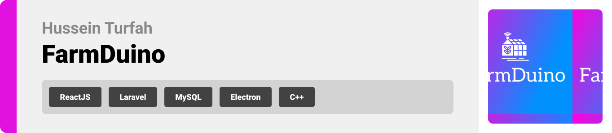

<br><br>

<!-- project philosophy -->
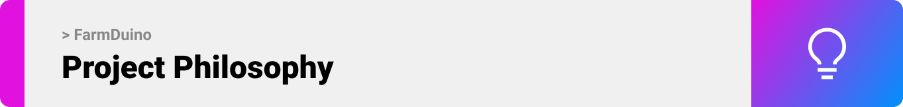

> FarmDuino is a desktop application designed to revolutionize greenhouse farming by providing an intuitive and efficient solution for controlling the farming environment.
> 
> Our goal is to empower greenhouse owners to easily manage and customize their greenhouse conditions, leading to improved crop yields and optimized farming processes.

### User Stories

- As a user, I want to monitor market prices for vegetables and fruits so that I can maximize profits.
- As a user, I want to log out of my account so that I can ensure the security of my account information.
- As a user, I want to change my email address so that I can update my contact information.
- As a user, I want to change my password so that I can enhance the security of my account.
- As a user, I want to reset my password so that I can regain access to my account if I forget it.
 
### Greenhouse Owner Stories

- As a greenhouse owner, I want to remotely monitor and customize actuators based on environmental factors so that I can optimize crop growth conditions.
- As a greenhouse owner, I want access to recommended environmental thresholds for my crops to configure the actuators and provide ideal conditions.
- As a greenhouse owner, I want to graphically visualize the historical data of environmental conditions, so that I can analyze trends and patterns in past occurrences.
- As a greenhouse owner, I want to check weather forecasts for my greenhouse location so that I can plan actuator schedules and adapt to upcoming weather conditions.
- As a greenhouse owner, I want to review past notifications so that I can stay informed about greenhouse incidents and changes during my absence.

### Admin Stories

- As an admin, I want to access a list of users and their planted crops so that I can conduct studies and researches.
- As an admin, I want to update the ticker with market prices of fruits and vegetables so that greenhouse owners can view them.

<br><br>

<!-- Prototyping -->
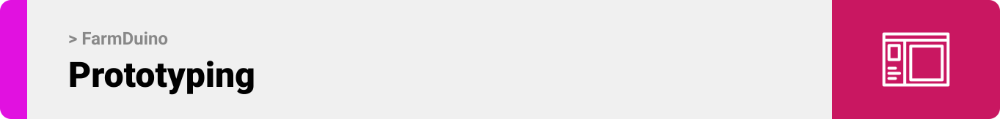

> We designed FarmDuino using wireframes and mockups, iterating on the design until we reached the ideal layout for easy navigation and a seamless user experience.

### Wireframes
| Login screen | Landing screen | Sensors screen | Admin Main Screen | Account Settings modal |
| ---| ---| ---| ---| ---|
| 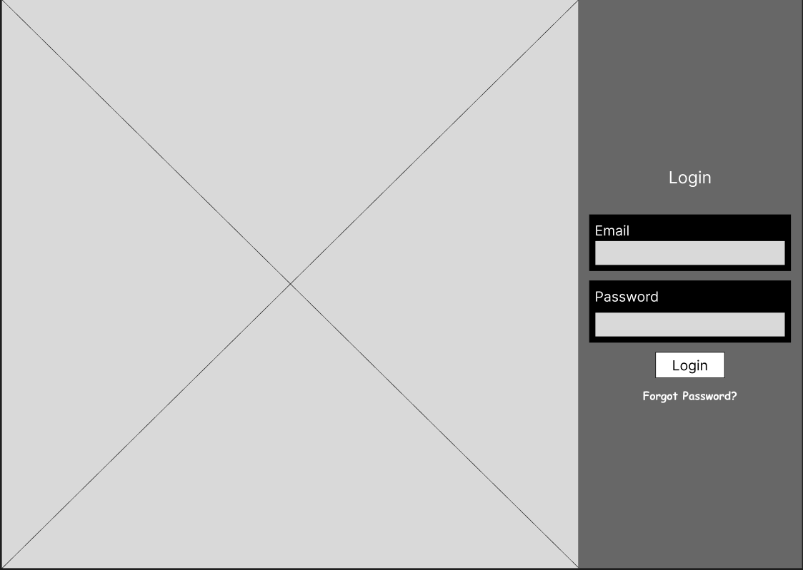 | 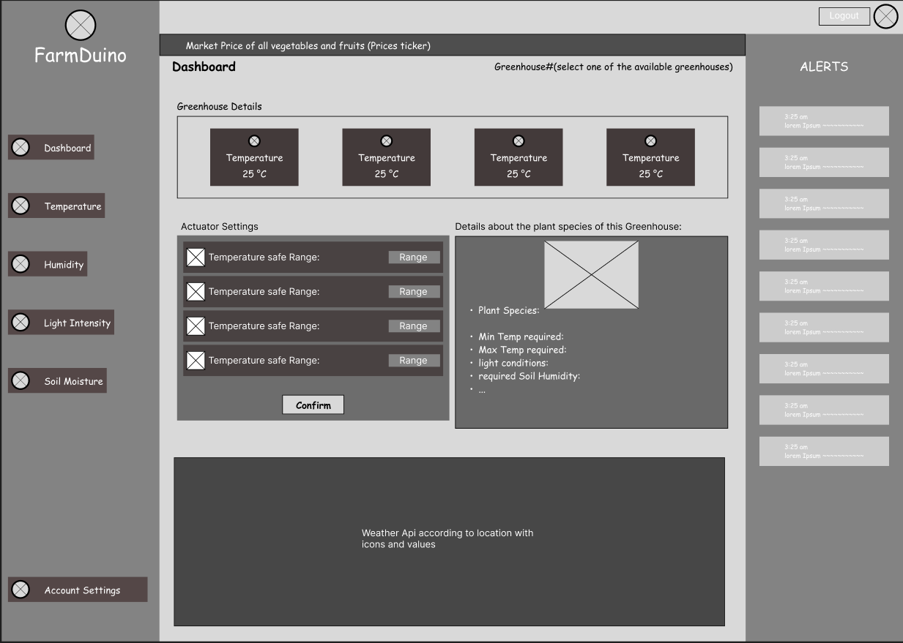 | 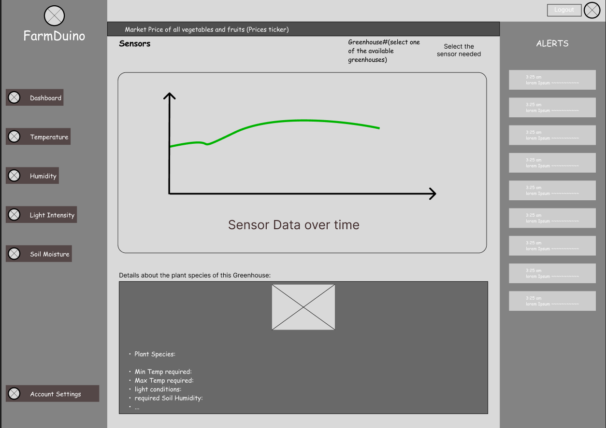 | 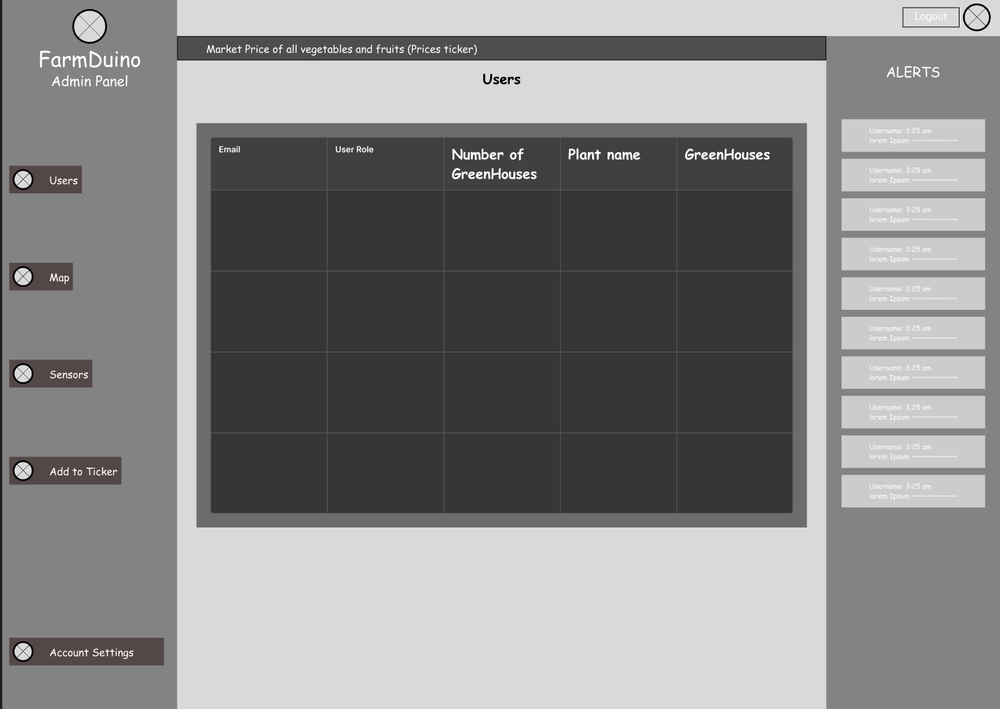 | 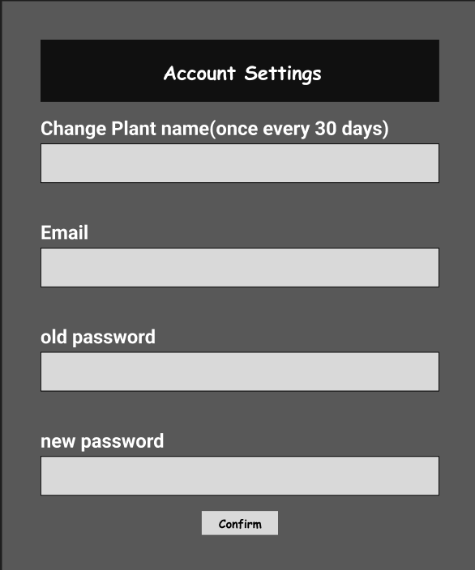 |

### Mockups
| Login screen  | Landing screen | Sensors screen | Admin Main Screen | Account Settings Modal | 
| ---| ---| ---| ---| ---| 
| 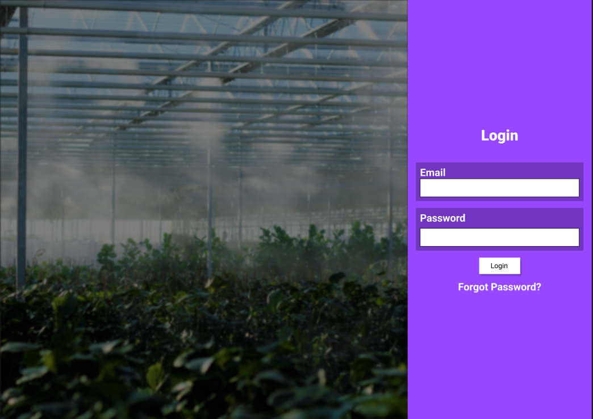 | 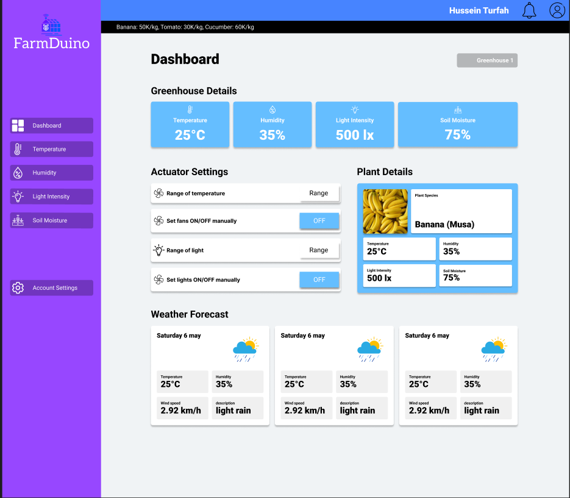 | 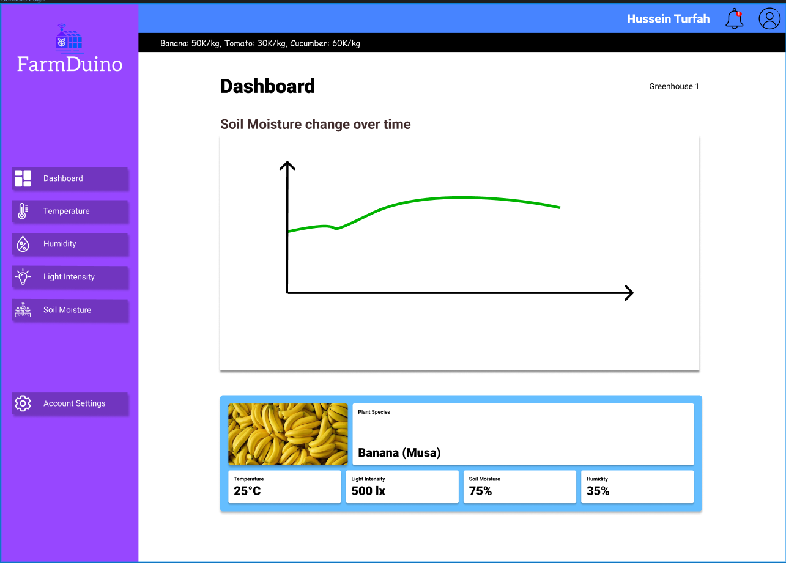 | 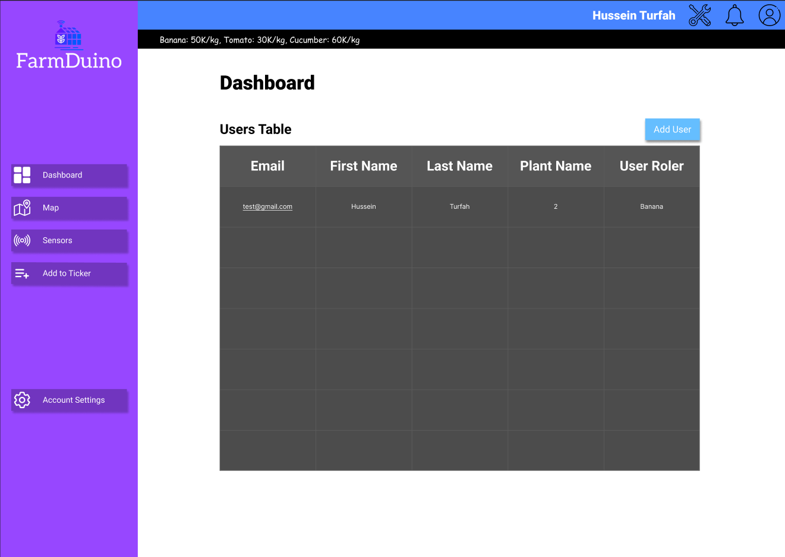 | 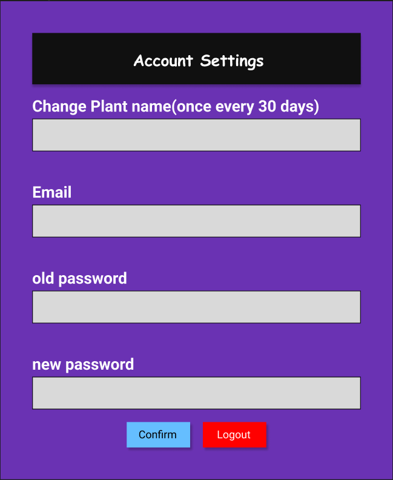 |

<br><br>

<!-- Implementation -->
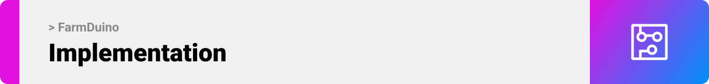

> Using the wireframes and mockups as a guide, we implemented the FarmDuino app with the following features:

### Greenhouse Owner Screens (Desktop & Web)
| Register page | Login page | Forgot Password page |
| ---| ---|  ---| 
|  |  | 

| Dashboard page | Account Settings modal | Temperature page | 
| ---| ---| ---| 
|  |  |  |  

| Soil Moisture page | Humidity page |Light Intensity page | Notifications Modal | 
| ---| ---| ---| ---|
|  |  |  |  |


### Admin Screens (Desktop & Web)
|  Login page (Same as User Login page) | Admin Dashboard | Insert Prices modal | Admin Settings Modal |
| ---| ---| ---| ---|
|  |  |  |  |

<br><br>

<!-- Tech stack -->
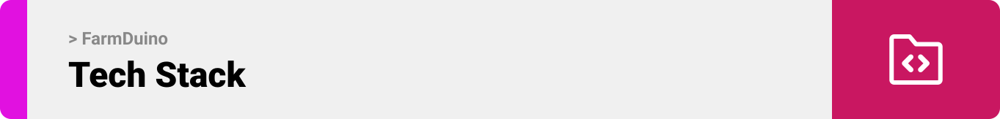

###  FarmDuino is built using the following technologies:

- The project utilizes [Arduino](https://www.arduino.cc/), a versatile microcontroller platform, to collect and analyze data from various farm sensors and control interconnected actuators.
- The project's backend utilizes the power of [Laravel](https://laravel.com/), a robust PHP framework renowned for its rapid and efficient web application development capabilities. 
- The application's frontend is crafted with [React.js](https://react.dev/), a widely adopted JavaScript library specifically designed for creating dynamic and engaging user interfaces.
- We leverage [Electron.js](https://www.electronjs.org/) to build a versatile desktop application that seamlessly runs on multiple operating systems, providing users with a consistent experience across platforms.
- We utilize the [Roboto](https://fonts.google.com/specimen/Roboto)  font as the primary typeface across the entire application, ensuring a clean and modern visual aesthetic.

<br><br>

<!-- How to run -->


> To set up FarmDuino locally, follow these steps:

### Prerequisites

To ensure the smooth functioning of your FarmDuino app, please make sure you have the following prerequisites installed on your computer:

- PHP: Required for running the FarmDuino app built with the Laravel framework.
- Composer: A dependency manager for PHP used by Laravel and required for managing Laravel's dependencies.
- Node.js: A runtime environment for executing JavaScript code outside of a web browser and required for running ReactJS components in Electron.
- npm (Node Package Manager): A package manager for Node.js used by ReactJS components in Electron and required for managing ReactJS dependencies.
- Arduino IDE: An integrated development environment for Arduino used for programming the Arduino microcontroller and flashing the written code to it.
- MySQL: Database management system used by Laravel for data storage and retrieval.

By having these prerequisites installed and configured correctly, you will be ready to develop and run the FarmDuino app with its various components seamlessly.


### Installation

1. Obtain API Keys at [OPENAI](https://openai.com/blog/openai-api), [Open Weather Map](https://openweathermap.org/api) and [Trefle](https://trefle.io/). These keys are required for the proper functioning of the application.
2. Clone the repository: Use the command provided below to clone the FarmDuino repository to your local machine.
   ```sh
   git clone https://github.com/Hussein-Turfah/FarmDuino.git
   ```
3. Install NPM Packages: Navigate to the `farmduino-desktop` folder and run npm install to install the required NPM packages.
   ```sh
   npm install
   ```
4. Install Composer Packages: Go to the `farmduino-server` folder and execute composer install to install the necessary Composer packages.
   ```sh
   composer install
   ```
5. Install Composer Packages: Go to the `farmduino-server` folder and execute composer install to install the necessary Composer packages.
   ```sh
   php artisan migrate
   ```
6. Configure API Keys: Inside `farmduino-server` folder, open the `.example.env` file, enter your obtained API keys for OpenAI, Open Weather Map the latitude and longitude of your greenhouse, and Trefle, and save the file as `.env`.
   ```js
   OPENAI_API_KEY = 'ENTER YOUR API'
   WEATHER_API_KEY='ENTER YOUR API'
   TREFLE_API_KEY = 'ENTER YOUR API';
   LATITUDE = 'ENTER YOUR LATITUDE'
   LONGITUDE = 'ENTER YOUR LONGITUDE'
   ```

### Flashing the code to the Arduino

1. Navigate to the `farmduino-arduino` folder.
2. Open the `farmduino-arduino.ino` file using the Arduino IDE.
3. Connect the Arduino board to your computer using a USB cable.
4. Select the Arduino board and port from the Tools menu in the Arduino IDE.
5. Click the Upload button in the Arduino IDE to flash the code to the Arduino.

### Running the application

1. Navigate to the `farmduino-server` folder.
2. Run the following command to start the application.
   ```sh
   php artisan serve
   ```
3. Navigate to the `farmduino-desktop` folder.
4. Run the following command to start the application.
   ```sh
   npm start
   ```

Now, you should be able to run FarmDuino locally and explore its features 🤩.