<br><br>

<!-- project philosophy -->


> A Desktop app for controlling farming environment, making it easier for greenhouse owners to change their greenhouse environment easily.
>
> FarmDuino is a smart farming solution that aims to streamline the agricultural process by providing a user-friendly platform for farmers to monitor and manage their crops. Our goal is to enhance the farming experience by saving time and improving crop yield.

### User Stories
- As a greenhouse owner, I want to register an account so that I can log my data under my email address.
- As a greenhouse owner, I want to login to my account so that I can control my greenhouses and view my data.
-	As a user, I want to be able to log out of my account so that I can ensure the security of my information and prevent unauthorized access.
- As a greenhouse owner, I want to be able to reset my password so that I’ll be able to access my account if I forgot the password.
- As a greenhouse owner, I want to be able to change my email address, so that I can update my contact information and receive important notifications on my new email address.
- As a greenhouse owner, I want to change my password, so that I can ensure the security of my account.
- As a greenhouse owner, I want to remotely monitor real-time temperature and humidity levels in my greenhouse, so that I can ensure the optimal growth conditions for my crops are being maintained.
- As a greenhouse owner, I want to remotely monitor soil moisture levels in my greenhouse, so that I can conserve water and reduce costs by watering my crops only when necessary.
- As a greenhouse owner, I want to monitor the light levels in my greenhouse so that I can ensure my crops are receiving the appropriate amount of light for optimal growth.
- As a greenhouse owner, I want to customize the triggering system of the actuators according to my crop’s needs in terms of temperature, humidity, light intensity, and soil moisture levels so that I can ensure optimal growth conditions for my crops.
- As a greenhouse owner, I want to receive real-time alerts when any sensor malfunctions, so that I can quickly identify and resolve any problems that arise.
- As a greenhouse owner, I want to remotely control devices in my greenhouse, such as turning on or off fans, heaters, or lights, so that I can ensure optimal growing conditions for my crops even when I am not on-site.
- As a greenhouse owner, I want to check previously triggered notifications so that I can know if anything happened during my rest hours.
- As a greenhouse owner, I want to check levels of temperature, humidity, light intensity, and soil moisture recommended for my crops so that I can make the actuators function accordingly. 
- As a greenhouse owner, I want to check the weather forecast on each greenhouse location so that I can plan for my actuator schedules ahead.
- As a greenhouse owner, I want to check the prices of different fruits and vegetables in the market so that I can know when I can get good selling prices.
- As an admin, I want to login to my account so that I can control the greenhouses and access my data.
- As an admin, I want to be able to change my email address, so that I can update my contact information.
- As an admin, I want to change my password, so that I can ensure the security of my account.
- As an admin, I want to view a list of the users along with their planted crops so that I can conduct studies on crops the Arduinos are being used for.
- As an admin, I want to check the prices of different fruits and vegetables in the market so that I can conduct studies of different purposes.
-	As an admin, I want to add market prices of different fruits and vegetables to a ticker so that I can show them to greenhouse owners.


<br><br>

<!-- Prototyping -->


> We designed FarmDuino using wireframes and mockups, iterating on the design until we reached the ideal layout for easy navigation and a seamless user experience.

### Wireframes
| Login screen  | Register screen |  Landing screen | 
| ---| ---| ---|
|  | 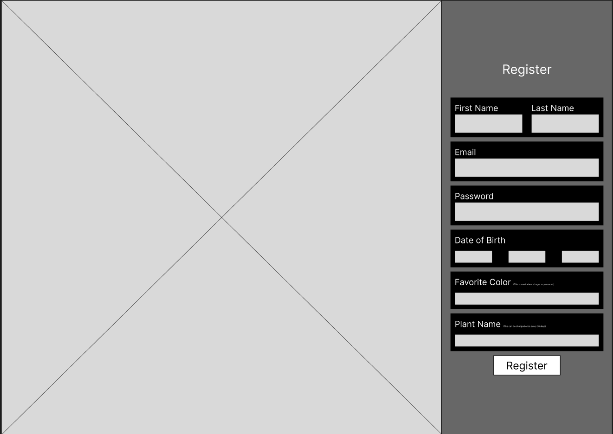 |  | 

| Sensors screen | Account Settings Modal | Admin Main Screen |
| ---| ---| ---|
 |  |  |

| Insert to Ticker Modal | Admin Settings Modal |
| ---| ---|
| 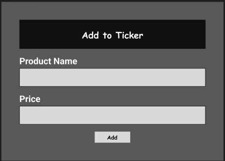 | 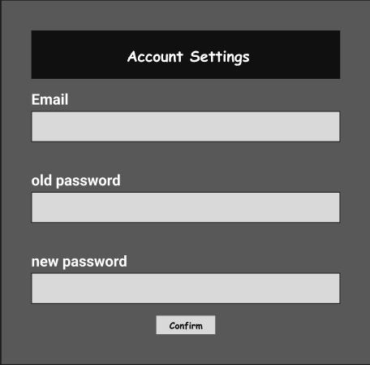 |

### Mockups
| Login screen  | Register screen |  Landing screen | 
| ---| ---| ---|
|  | 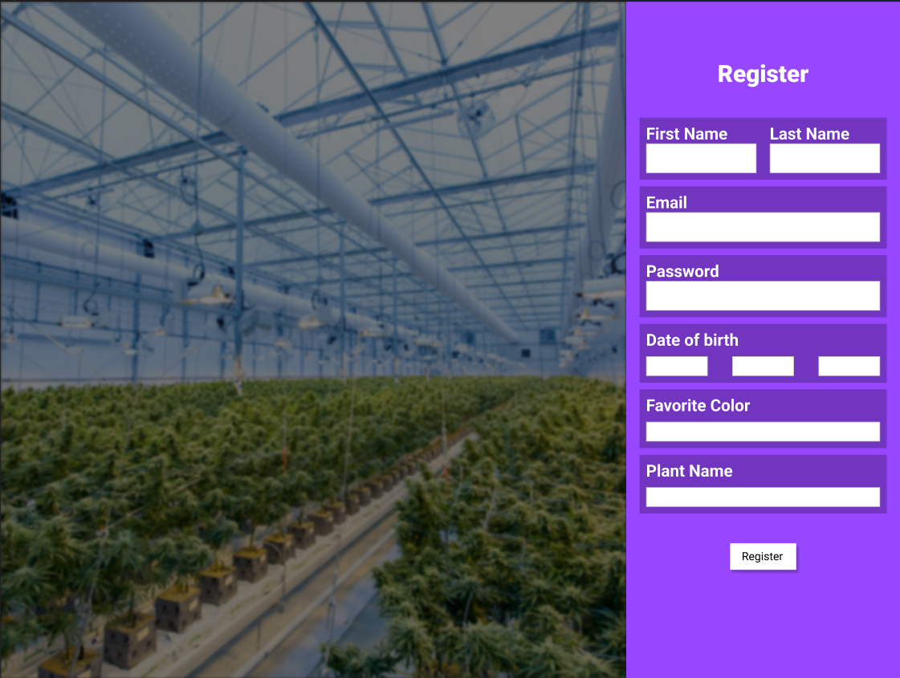 |  | 

| Sensors screen | Account Settings Modal | Notifications Modal |
| ---| ---| ---|  
|  |  | 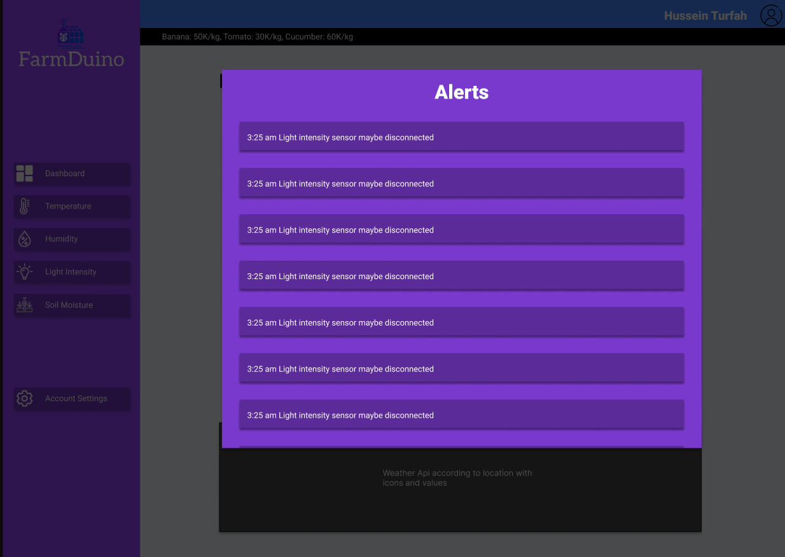 |  |

| Admin Main Screen | Insert to Ticker Modal | Admin Settings Modal |
| ---| ---| ---|
| 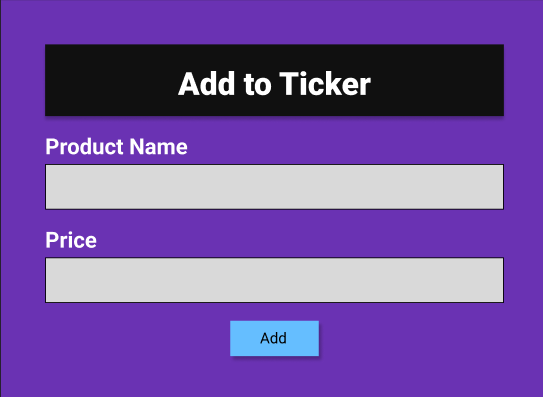 | 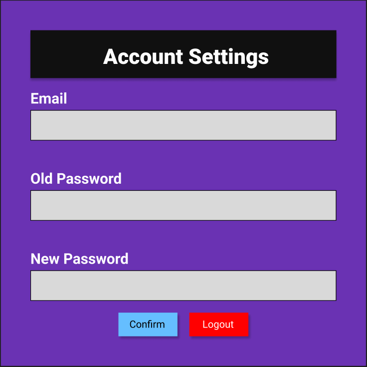 |  |

<br><br>

<!-- Implementation -->


> Using the wireframes and mockups as a guide, we implemented the FarmDuino app with the following features:

### User Screens (Desktop & Web)
| Login screen  | Register screen | Landing screen |  Landing Screen | 
| ---| ---|  ---| ---|
| 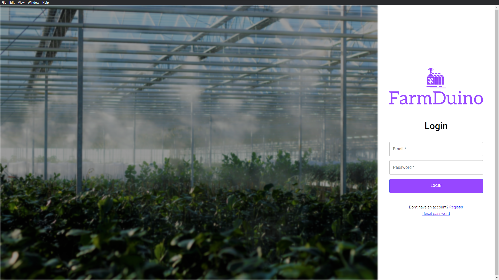 | 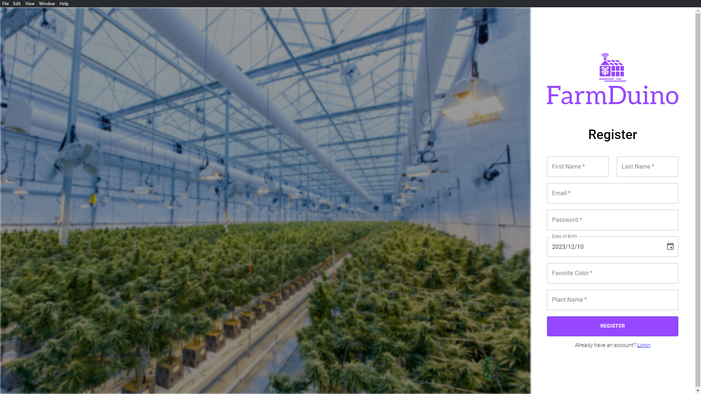 | 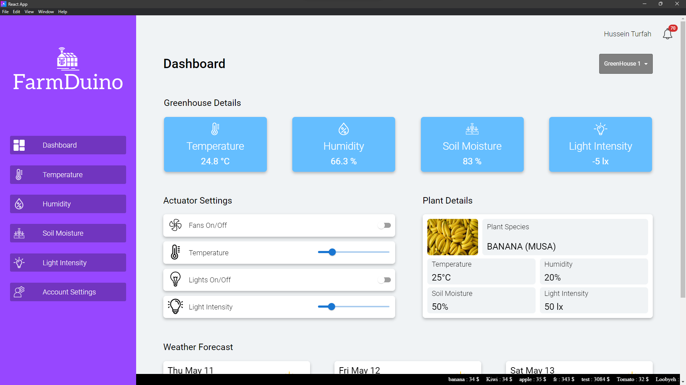 | 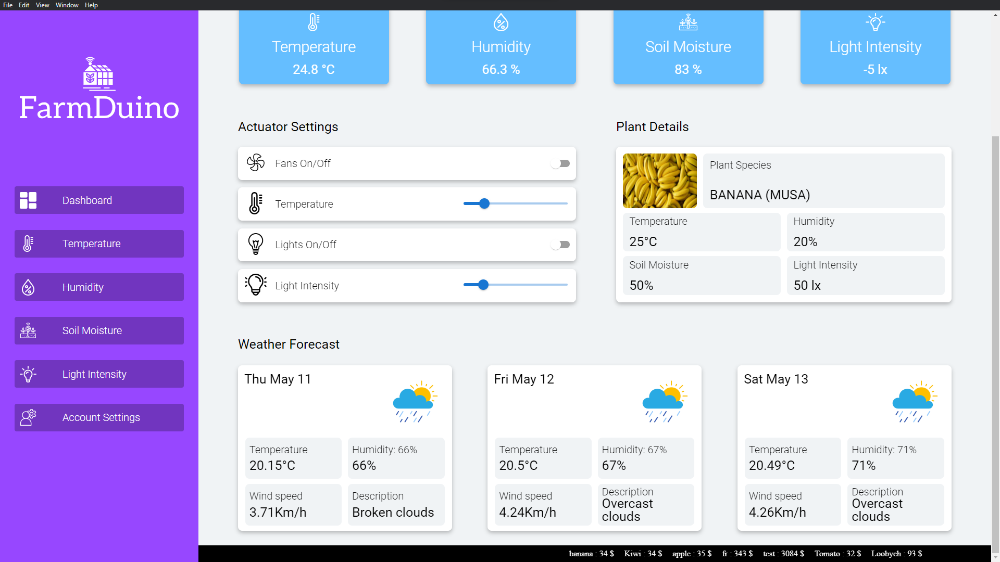 |

| Sensors screen | Sensors screen | Account Settings Modal | Notifications Modal | 
| ---| ---| ---| ---|
| 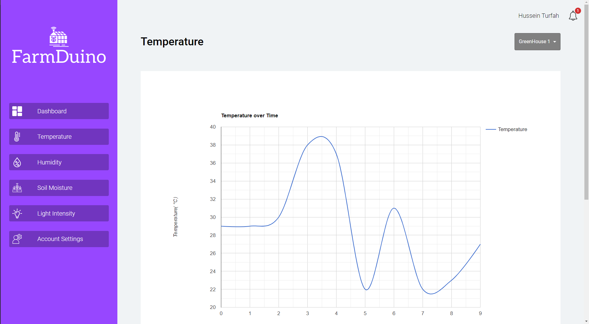 | 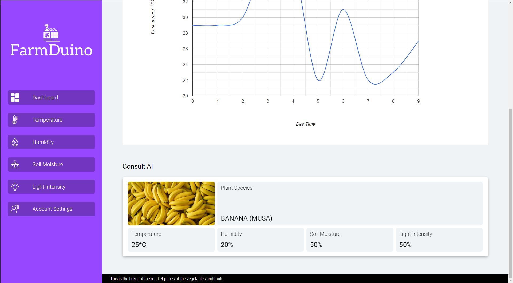 | 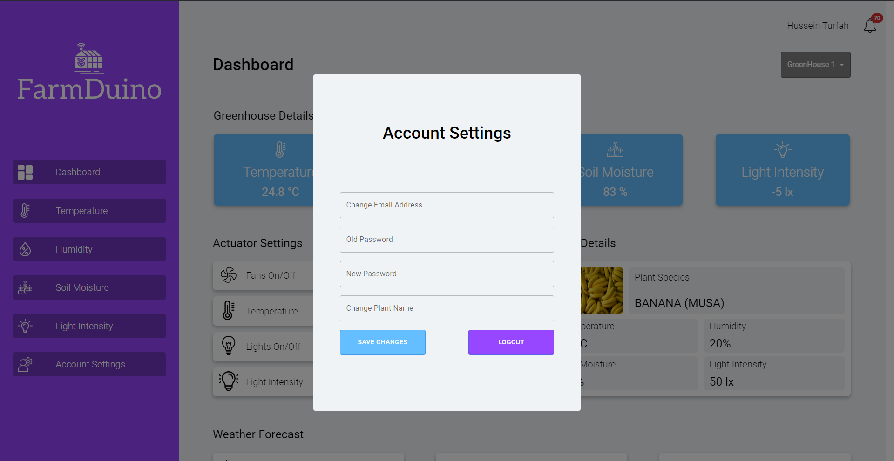 | 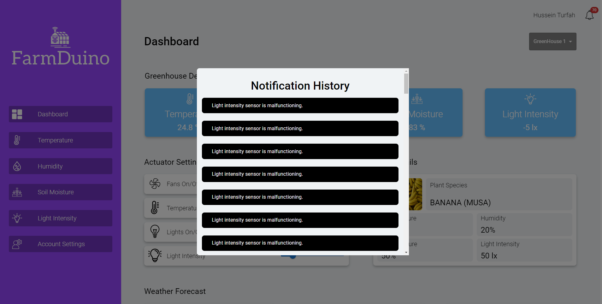 |


### Admin Screens (Desktop & Web)
|  Landing Screen | Settings Modal | Ticker Modal |
| ---| ---| ---|
| 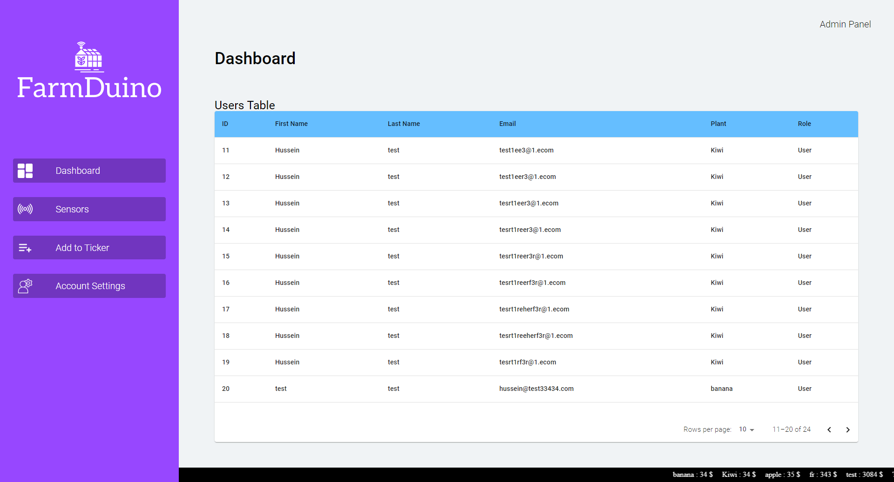 |  | 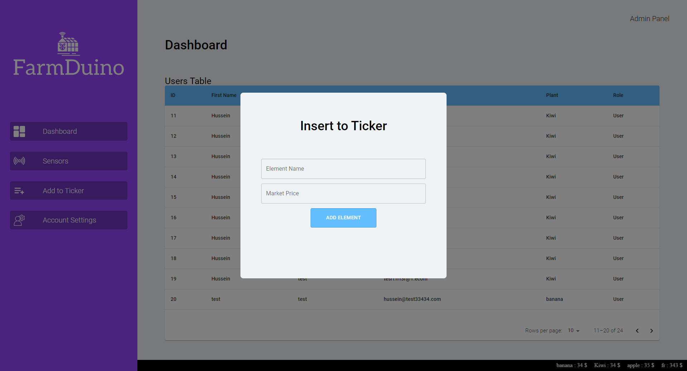 |

<br><br>

<!-- Tech stack -->


###  FarmDuino is built using the following technologies:

- The project uses [Arduino](https://www.arduino.cc/), a microcontroller platform, to collect and process data from various sensors installed in the farm.
- The frontend of the application is built using [React JS](https://react.dev/), a popular JavaScript library for building user interfaces.
- [Electron JS](https://www.electronjs.org/) is used to develop a desktop application that can be installed and used on different operating systems.
- [Laravel](https://laravel.com/) is used to develop the backend of the application. Laravel is a PHP framework that allows us to build web applications quickly and efficiently.
- [Roboto](https://fonts.google.com/specimen/Roboto) font is used as the main font throughout the application.

<br><br>

<!-- How to run -->


> To set up FarmDuino locally, follow these steps:

### Prerequisites

Make sure you have the following installed on your computer:

   - Composer
   - npm (Node Package Manager)
   - PHP
   - MySQL
   - Node.js


### Installation

_Below is an example of how you can instruct your audience on installing and setting up your app. This template doesn't rely on any external dependencies or services._

1. Get a free API Key at [OPENAI](https://openai.com/blog/openai-api) and at [Open Weather Map](https://openweathermap.org/api)
2. Clone the repo
   ```sh
   git clone   https://github.com/Hussein-Turfah/FarmDuino.git
   ```
3. Install NPM packages inside the `desktop` folder
   ```sh
   npm install
   ```
4. Install Composer packages inside the `server` folder
   ```sh
   composer install
   ```
5. Migrate the database from inside the `server` folder 
   ```sh
   php artisan migrate
   ```
6. Enter your API in `.example.env` and rename it to `.env`
   ```js
   OPENAI_API_KEY = 'ENTER YOUR API'
   WEATHER_API_KEY='ENTER YOUR API'
   TREFLE_API_KEY = 'ENTER YOUR API';
   ```

Now, you should be able to run FarmDuino locally and explore its features 🤩.